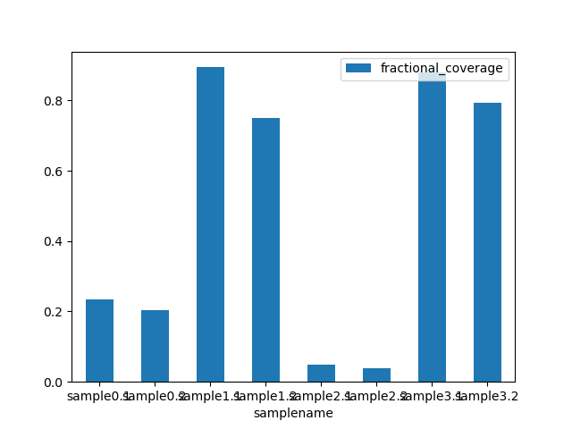

---
output:
  html_document: default
  word_document: default
  pdf_document: default
---

# Rebecca Fuchs

## Analysis of sample reads 

commandline input: python sequence_coverage_analysis.py
Within script, input of samples (fastq files) are in sample_data folder
All sam, bam, and output files are created in the folder
 

#### Alignment   

[  If you have reasons for using the aligner that you've used, please provide them here.  ]

I chose to use BWA for alignment. This software is good for mapping low divergent sequeces against large reference genomes. I used BWA-MEM, the algorithm recommended on the website because it is faster and more accurate then other algorithms. The website this algorithm has the best performance with illumina reads.
http://bio-bwa.sourceforge.net/
Alignment files were output as sam files, then samtools is used to convert them into bam files

  

#### Fractional Coverage 

[  Please list the fractional coverages for each sample here. If this lives in a file, just specify the 
path.  ]

The fractional coverages for each sample are in the file all_frac_coverage_outputs.csv

I define fractional coverage as the fraction of reference sequence 
(here, the mecA gene) covered by reads to depth greater than or 
equal to some user-specified threshold (e.g., 5). user imput in script 
(in the fractional coverage function)

Here is the table

samplename, fractional_coverage
sample0.1, 0.23547
sample0.2, 0.20417
sample1.1, 0.89419
sample1.2, 0.74963
sample2.1, 0.04918
sample2.2, 0.03775
sample3.1, 0.87928
sample3.2, 0.79235

  

#### Visualizing Fractional Coverage

This plot shows fractional coverage in a bar plot. 
We can see the largest coverage come from sample1.1, and sample3.1.
These samples are most similar to the refrence genome. 

  

#### Align and Analyze Genome Coverage 

[  Please providing the resulting plots here. And then below the plots provide your written answers. ] 

This graph shows coverage over a refrence sequence download, *S. aureus* reference genome `GCF_000013425`.
From looking at this plot, you can see sample 3.2 has less depth across the reference. The sample 1.2 looks to have higher depth coverage of most of the reference. All samples are lacking in read depth in positions about 1.5e6, and about 1.9e6. 
